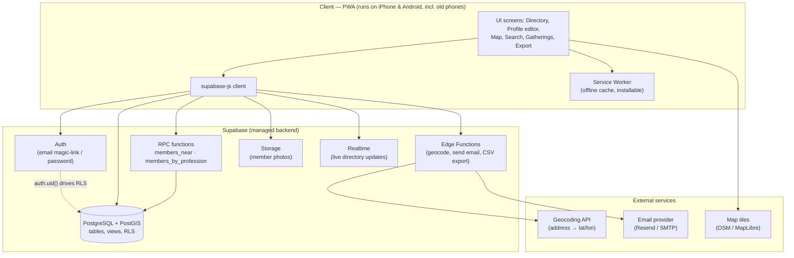
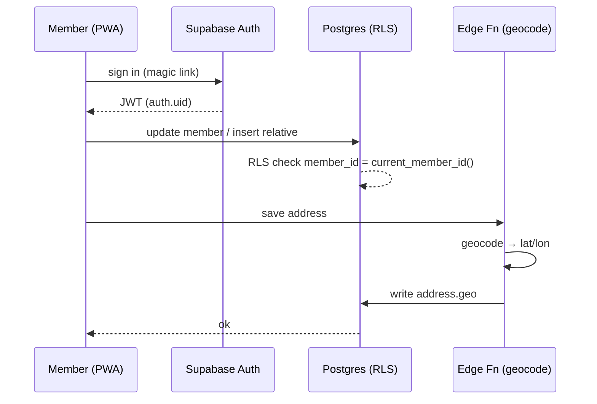
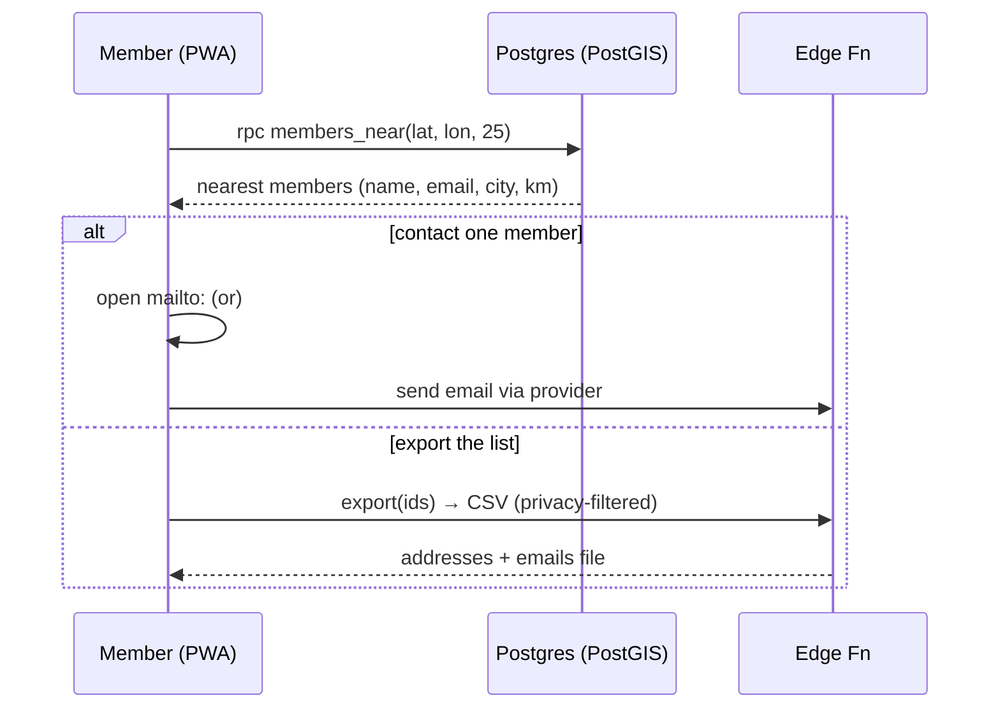
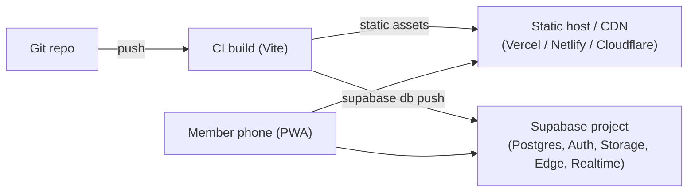
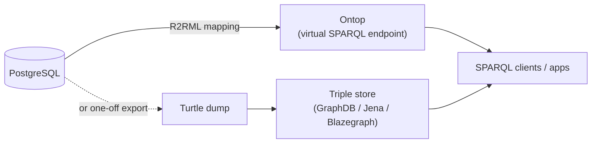

# GermaniaApp — Architecture

How the whole system fits together: the client that runs on phones, the Supabase
backend, the external services, and the path from a relational start to RDF/OWL +
SPARQL. The data model itself lives in `DATA_MODEL.md` / `schema.sql`; this document is
the **architecture outlay** around it.

---

## 1. System overview



The client talks **directly** to Supabase for ordinary reads/writes (Row Level Security
makes that safe). Anything needing a secret key or a third party — geocoding, sending
email, building a CSV — goes through an **Edge Function** so credentials never reach the
phone.

---

## 2. Layers

**Client (PWA).** A single responsive web app, installable to the home screen, cached by
a service worker so it opens and shows last-seen data even on a flaky connection. Chosen
over native (React Native/Flutter) because it runs on *very old* Android browsers and
old iOS Safari with no app-store gate — your "seamless on old phones" requirement.
Suggested stack: a small framework (Svelte or vanilla + Vite, or React if preferred),
`supabase-js`, and **MapLibre GL** (open-source, no API-key lock-in) for the map.

**Backend (Supabase).** Postgres is the source of truth. The phone never sees raw tables
it shouldn't — RLS scopes every row by `auth.uid()`. The search functions
(`members_near`, `members_by_profession`) run *in* the database, so the phone sends a
tiny RPC call and gets back a small result set rather than downloading the directory.

**External services.** Geocoding turns an address into the `geo` point on save. Map tiles
render the map. An email provider delivers member-to-member contact and digests. All
reached only through Edge Functions.

---

## 3. Feature data flows

**Edit own profile / add spouse & children**



**Proximity search → contact / export**



**Map** reads `member_directory` (lat/lon per member) plus `gathering.geo` for event
pins; markers cluster client-side. **Gatherings** are rows with an iCal `recurrence_rule`
that the client expands into upcoming dates.

---

## 4. Security model

- **Authentication:** Supabase Auth issues a JWT carrying `auth.uid()`.
- **Authorization:** Postgres RLS on every table. A member can write a row only when its
  `member_id` resolves to their own member record (`current_member_id()`); reads obey
  each row's `visibility` / `show_email` / `show_address` flags.
- **Secrets stay server-side:** geocoding keys, the email API key, and any bulk-export
  logic live in Edge Functions, never in the client bundle.
- **Privacy by design:** the export view nulls out email/address for members who opted
  out, so a CSV can't leak what a member chose to hide.

---

## 5. Suggested code structure (PWA)

```
germania-app/
├─ src/
│  ├─ lib/supabase.ts        # client init
│  ├─ lib/queries.ts         # typed wrappers: membersNear(), byProfession(), exportCsv()
│  ├─ routes/
│  │  ├─ directory/          # list + filters
│  │  ├─ profile/            # own-entry editor, relatives
│  │  ├─ map/                # MapLibre view
│  │  ├─ search/             # proximity + profession
│  │  └─ gatherings/         # list, create, RSVP
│  ├─ components/            # cards, map markers, forms
│  └─ sw.ts                  # service worker (offline cache)
├─ supabase/
│  ├─ migrations/            # schema.sql lives here
│  └─ functions/
│     ├─ geocode/
│     ├─ send-email/
│     └─ export-contacts/
└─ vite.config.ts
```

---

## 6. Deployment topology



The PWA is static files on a CDN (fast, cheap, cache-friendly for old devices). Supabase
is the single managed backend. Schema changes ship as migrations; Edge Functions deploy
with the Supabase CLI.

---

## 7. Phased roadmap

1. **Schema + backend (done in `schema.sql`).** Tables, views, search functions, RLS.
2. **Data layer.** Typed query wrappers in `lib/queries.ts` over the RPCs and views.
3. **Core screens.** Profile editor (with relatives), directory, profession + proximity
   search, email contact, CSV export.
4. **Map + gatherings.** MapLibre member/event pins; gathering create + RSVP + recurrence.
5. **Polish for old phones.** Service worker, small bundle, graceful no-JS fallbacks.
6. **RDF/OWL + SPARQL phase (see below).**

---

## 8. RDF/OWL phase — where it plugs in



Two non-disruptive options, both already enabled by the design (UUID IRIs, clean FKs,
standard vocabularies in `ontology.ttl`):

- **Virtual graph (recommended first):** put **Ontop** in front of Postgres with an R2RML
  mapping. SPARQL queries run live against the same database — no data copy, no second
  source of truth. GeoSPARQL gives the same proximity queries as PostGIS.
- **Native triple store:** export to Turtle and load GraphDB/Jena/Blazegraph when you
  want full OWL reasoning (e.g. the transitive `broaderCategory` so a search on "Medicine"
  returns urologists automatically).

The app can keep using Supabase for day-to-day CRUD while the SPARQL endpoint serves
richer queries and integrations — they coexist.
