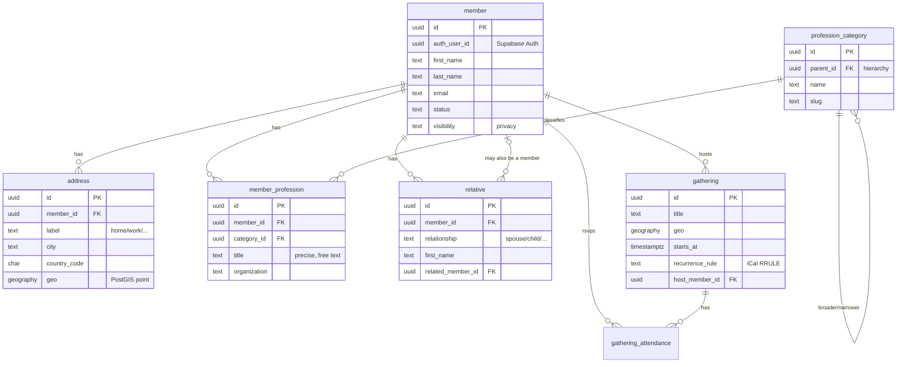

# GermaniaApp — Data Model

This is the **first deliverable: the data model only.** It is built for **Supabase
(PostgreSQL)** today and designed to migrate cleanly to **RDF/OWL + SPARQL** later.
Two companion files:

- `schema.sql` — the full PostgreSQL/Supabase schema (run it in the Supabase SQL editor).
- `ontology.ttl` — the OWL ontology + example SPARQL queries for the RDF phase.

---

## What the model has to support

Every requirement maps to specific tables, functions, or policies:

| Requirement | Where it lives |
|---|---|
| Members are the main content | `member` |
| Members edit **their own** entry only | Row Level Security on every table (`auth_user_id = auth.uid()`) |
| Precise profession ("urologist", "real-estate-specialized lawyer") | `member_profession.title` (free text) + optional `profession_category` taxonomy |
| Add spouses and children | `relative` (with `relationship` = spouse/partner/child) |
| Search members by proximity | `members_near(lat, lon, radius_km)` over `address.geo` (PostGIS) |
| Search by profession + contact by email | `members_by_profession(q)`, plus `member.email` |
| Map of where members live | `address.geo` (lat/lon in `member_directory`) |
| Gatherings worldwide, weekly/monthly | `gathering` with iCalendar `recurrence_rule` |
| Export address / email lists for a search | `member_contact_export` view + the search functions |

---

## Entities

---

## Key design decisions

**Professions: free text *and* taxonomy.** Members type the precise title they want
(`member_profession.title`), so nothing is lost. An optional link to
`profession_category` (a self-referencing tree like Medicine → Urology, Law →
Real estate law) gives clean facets and lets a search on "Medicine" also match a
urologist. Fuzzy matching uses a `pg_trgm` index, so `members_by_profession('urolog')`
works without exact spelling.

**Relatives are their own people.** Spouses and children live in `relative` and need
not be society members. If a relative *is* also a member, `related_member_id` links the
two records — which becomes a real `hasSpouse`/`hasChild` edge in the RDF graph.

**Locations use PostGIS `geography(Point)`.** This stores true lat/lon and gives
metre-accurate distance, so `members_near(...)` and the map both read from one column.
`address.geo` is filled by geocoding the address when a member saves it (e.g. via a
geocoding API in the app, or a Supabase Edge Function).

**Gatherings carry an iCalendar `RRULE`.** `FREQ=WEEKLY;BYDAY=TH` (weekly Thursdays) or
`FREQ=MONTHLY;BYDAY=1FR` (first Friday monthly). One column expresses any cadence; the
app expands the rule into concrete dates for display.

**Privacy is per-member.** `visibility`, `show_email`, `show_address`, `show_family`
let each member control exposure. The export view honours `show_email`/`show_address`.

**Members edit only their own data.** Every table has Row Level Security. Writes are
allowed only when the row's `member_id` resolves to the logged-in user
(`current_member_id()`); reads follow each row's visibility setting.

---

## How the main screens are served

- **Directory / list:** `select * from member_directory` — one flat row per member with
  primary address and primary profession.
- **Proximity search:** `select * from members_near(52.52, 13.405, 25);` → members
  within 25 km, nearest first.
- **Profession search:** `select * from members_by_profession('lawyer');`
- **Contact by email:** the result rows include `email`; the app opens a `mailto:` (or a
  Supabase Edge Function can send through the app).
- **Export addresses/emails:** join any search result to `member_contact_export` and
  download as CSV — emails and postal addresses already assembled and privacy-filtered.
- **Map:** `member_directory.latitude` / `longitude` feed map markers;
  `gathering.geo` adds event pins.

---

## Platform note (your "very old phones" question)

For *seamless on very old phones*, a **PWA (responsive web app)** is the better target
than React Native or Flutter: native frameworks have minimum-OS floors and heavier
runtimes, whereas a lightweight web app runs on old Android browsers and old iOS Safari,
installs to the home screen, and needs no app-store approval. **This choice does not
affect the data model** — Supabase serves a PWA, a native app, or an RDF endpoint
equally well. We can revisit it when we build the app layer.

---

## Migration path to RDF/OWL + SPARQL

The relational model was designed to lift into a triple store without redesign:

1. **Stable IRIs.** UUID primary keys become resource IRIs
   (`https://germania.app/resource/{uuid}`).
2. **Tables → classes.** `member`→`germ:Member`, `relative`→`germ:Relative`,
   `address`→`germ:Address`, `member_profession`→`germ:Profession`,
   `gathering`→`germ:Gathering` (see `ontology.ttl`).
3. **Foreign keys → object properties.** `livesAt`, `hasProfession`, `hasSpouse`,
   `hasChild`, `attends`, `hostedBy`. The profession tree uses a **transitive**
   `broaderCategory`, so a SPARQL search on a broad field matches narrow specialties.
4. **Standard vocabularies** for portability: FOAF (people), vCard (contact/postal),
   GeoSPARQL (`geo:asWKT` for distance queries).
5. **Two ways to get there:** expose the existing Postgres as a virtual graph with an
   R2RML mapper (e.g. **Ontop**) — no data copy, SPARQL on top of Postgres — or do a
   one-off export to Turtle and load a native triple store (GraphDB, Apache Jena,
   Blazegraph). GeoSPARQL gives the same proximity queries as PostGIS.

`ontology.ttl` contains the full class/property definitions, a worked example
individual, and ready-to-run SPARQL for proximity, profession (taxonomy-aware),
contact-list export, and family lookups.

---

## To deploy the schema

1. Create a Supabase project.
2. SQL editor → paste `schema.sql` → run. It enables `pgcrypto`, `postgis`, and
   `pg_trgm`, then creates the tables, views, functions, and RLS policies.
3. Wire Supabase Auth so each member's `auth_user_id` is set on first login.
4. Geocode addresses on save (geocoding API or Edge Function) to populate `geo`.

> Validation note: the SQL was checked with the PostgreSQL grammar parser (60
> statements, all valid). A live PostGIS run wasn't possible in this sandbox, so confirm
> the one extension step on Supabase — PostGIS is available there by default.
